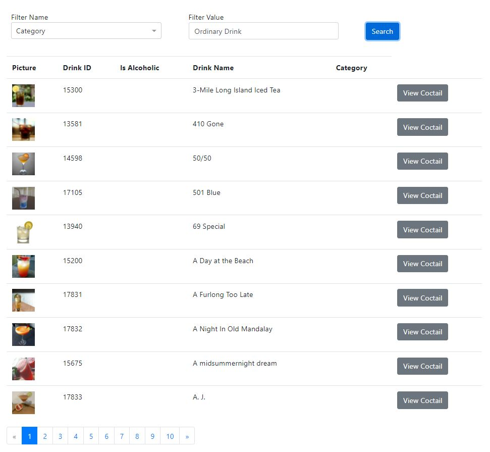
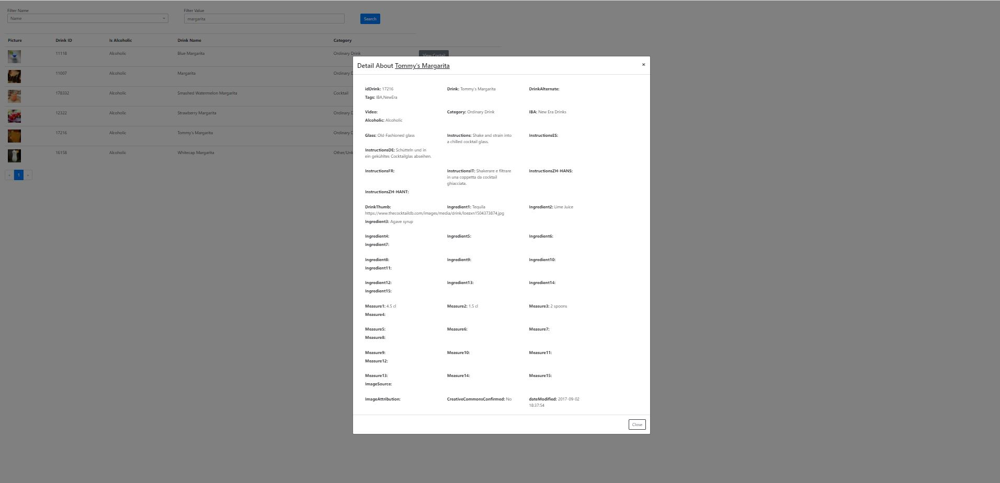

# DrinkManagement Application
This is the source code repository of drink management application that works on Angular Front End Framework using, JavaScript, Bootstrap and additional Libraries.

## Project Structure
 Application is designed in a way that it can be scalable.  
`Modular way of implementing the code is being chosen because it could easily be reusable by other modules. The project file structure is consisting of components, services, apis, models and some other helper functions` 

## Application Running Steps
  You need to make sure that you will have Angular already being installed to your component. Below steps is going to install necessary dependencies and will run the application. the app is being listened at `http://localhost:4200`
1. `npm install`
2. `ng serve`

## Detais about the Code Implementaion
1. The AutoUnsubscribe method is being developed in a way that whenever you need to go to another page your observables are going to be destroyed. This will help the application to become faster. What you just need to do is to add `@AutoUnsubscribe` decorator to any component you want to unsubscribe
2. Dynamic positioning of text fields were developed. In `CoctailDetailComponent`, you will see that the data is being postioned dynamically with the method of `chunkSizeSettingForDynamicRow()`. The reason for this is because, we don't have enough data to position the coctail detail.
3. Pagination is added to the List page because the data could be huge and we give the flexibility of loading the list faster using the client side pagination

## Screenshots from the Application

## Testing
Testing Bed is prepared for the application to continue writing the test cases of methods. Some simple test cases are added but some additions are to be made  to cover all the code base
